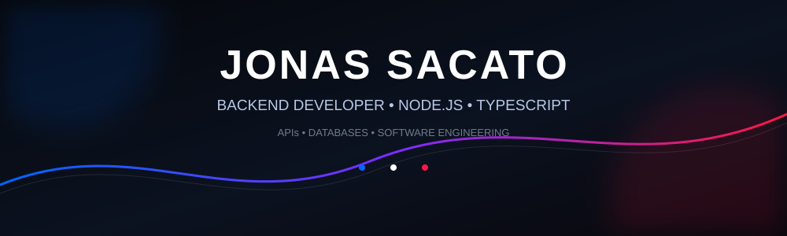
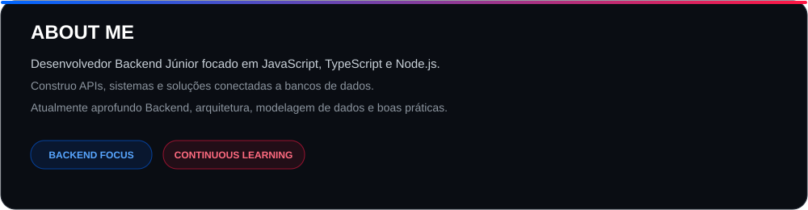
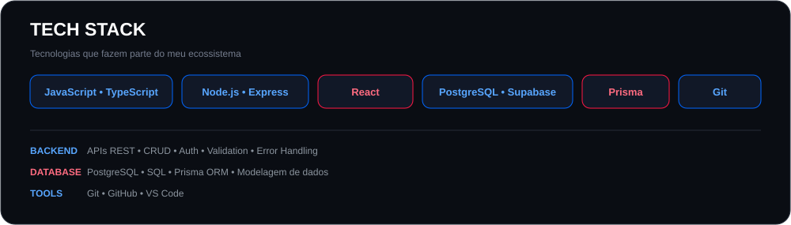
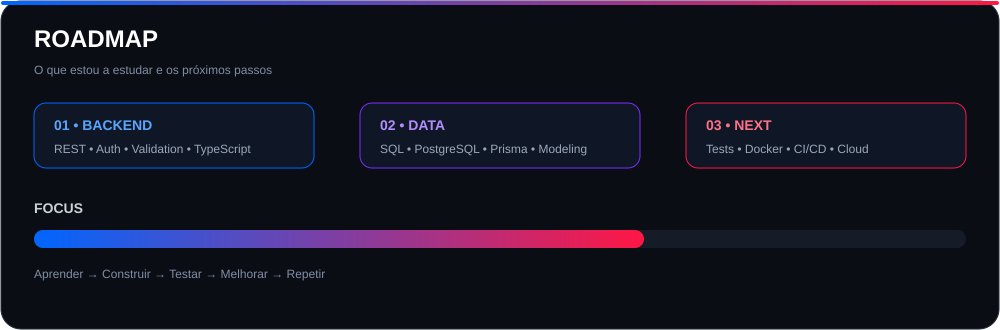
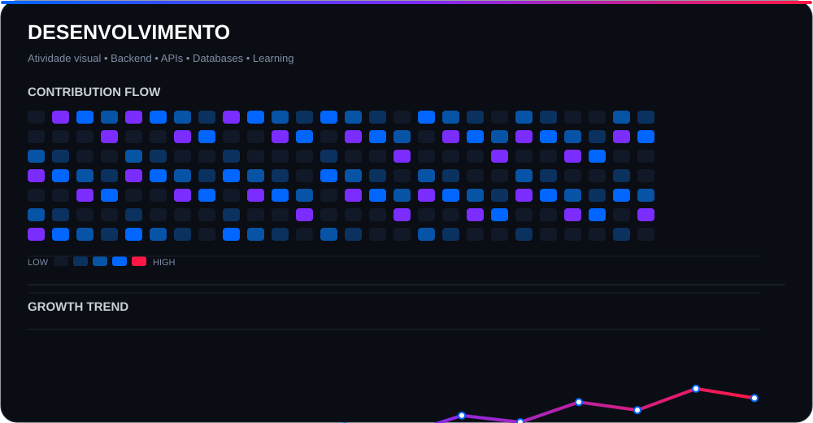

 

&nbsp;

&nbsp;

---

## 👨‍💻 SOBRE MIM

---

## 🛠️ TECNOLOGIAS & ECOSSISTEMA

  

---

## 📚 O QUE ESTOU A ESTUDAR

<table>
<tr>
<td width="50%" valign="top">

### 🔵 Desenvolvimento Backend

- APIs REST
- CRUD
- Autenticação
- Autorização
- Tratamento de erros
- Validação de dados
- Segurança de APIs
- TypeScript

</td>
<td width="50%" valign="top">

### 🔴 Dados & Arquitetura

- PostgreSQL
- SQL
- Modelagem de dados
- Prisma ORM
- Arquitetura de aplicações
- Otimização de consultas

</td>
</tr>
<tr>
<td width="50%" valign="top">

### ⚡ Engenharia de Software

- Código limpo
- Princípios SOLID
- Padrões de projeto
- Boas práticas

</td>
<td width="50%" valign="top">

### 🚀 Próximos Passos

- Testes automatizados
- Docker
- CI/CD
- Cloud
- Microsserviços
- Sistemas distribuídos

</td>
</tr>
</table>

---

## 🚀 PROJETOS EM DESTAQUE

<table>
<tr>
<td width="50%" valign="top">

<h3>🔌 API REST</h3>

API Backend desenvolvida para praticar endpoints, operações CRUD e integração com banco de dados.

<strong>Stack</strong>

</td>
<td width="50%" valign="top">

<h3>🔐 SISTEMA DE AUTENTICAÇÃO</h3>

Projeto focado em utilizadores, autenticação, autorização e proteção de rotas.

<strong>Stack</strong>

</td>
</tr>
</table>

---

## 📊 DESENVOLVIMENTO

> **Nota:** os gráficos acima são elementos visuais estáticos criados para o design do perfil. Não representam estatísticas reais do GitHub.

---

## 🎯 OBJETIVOS

<table>
<tr>
<td width="33%" align="center">

### 🚀 EVOLUÇÃO

Aprofundar conhecimentos em Backend, arquitetura e engenharia de software.

</td>
<td width="33%" align="center">

### 🧠 APRENDIZAGEM

Construir projetos cada vez mais completos e aplicar novas tecnologias.

</td>
<td width="33%" align="center">

### 💼 CARREIRA

Criar um portfólio sólido e conquistar oportunidades como desenvolvedor Backend.

</td>
</tr>
</table>

---

## 💡 MINHA FILOSOFIA

### `Aprender → Construir → Testar → Melhorar → Repetir`

Cada projeto é uma oportunidade para aprender algo novo e evoluir como desenvolvedor.

 

---

## 🤝 VAMOS NOS CONECTAR?

Estou sempre aberto a aprender, colaborar e conhecer outros desenvolvedores.

  

  

  

   

🔵 **APRENDER** &nbsp; • &nbsp; 🔴 **CONSTRUIR** &nbsp; • &nbsp; 🔵 **EVOLUIR**

  

⭐ Se algum dos meus projetos for útil para ti, considera deixar uma estrela!

