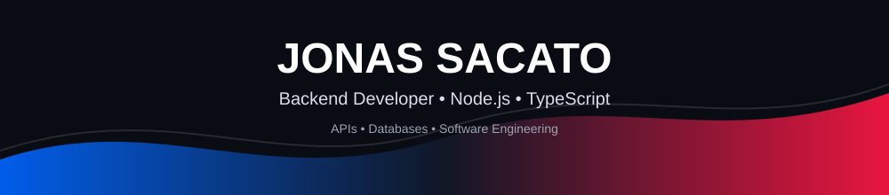
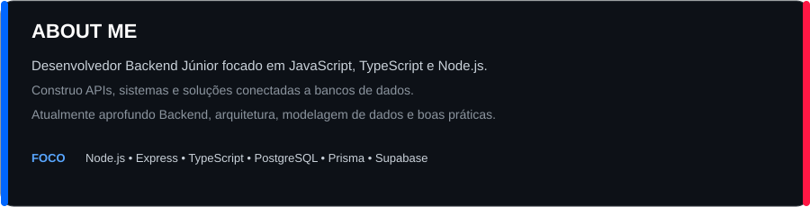
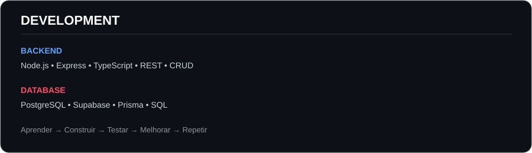
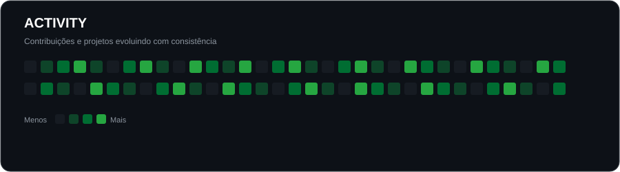

  

&nbsp;

&nbsp;

---

---

## 🛠️ Technologies

### 💻 Languages & Backend

### ⚛️ Frontend

### 🗄️ Database & ORM

### 🔧 Tools

---

## 📚 Currently Learning

<table>
<tr>
<td width="50%" valign="top">

### 🔌 Backend

- APIs REST
- CRUD
- Autenticação
- Autorização
- Validação de dados
- Tratamento de erros
- Segurança de APIs
- TypeScript

</td>
<td width="50%" valign="top">

### 🗄️ Data & Architecture

- PostgreSQL
- SQL
- Modelagem de dados
- Prisma ORM
- Arquitetura de aplicações
- Otimização de consultas

</td>
</tr>
<tr>
<td width="50%" valign="top">

### 🧠 Software Engineering

- Código limpo
- Princípios SOLID
- Padrões de projeto
- Boas práticas

</td>
<td width="50%" valign="top">

### 🚀 Next Steps

- Testes automatizados
- Docker
- CI/CD
- Cloud
- Microsserviços
- Sistemas distribuídos

</td>
</tr>
</table>

---

## 🚀 Featured Projects

<table>
<tr>
<td width="50%" valign="top">

### 🔌 REST API

API Backend desenvolvida para praticar criação de endpoints, operações CRUD e integração com banco de dados.

**Tecnologias:** Node.js • TypeScript • Prisma • PostgreSQL

</td>
<td width="50%" valign="top">

### 🔐 Sistema de Autenticação

Projeto focado na construção de sistemas de utilizadores, autenticação, autorização e proteção de rotas.

**Tecnologias:** Node.js • Express • PostgreSQL

</td>
</tr>
</table>

---

## 📊 Statistics

---

## 📈 Activity

> A imagem acima é **estática e editável**. Ela não depende do `github-readme-stats`, Vercel ou outro serviço externo.

---

## 🎯 Goals

<table>
<tr>

<td width="33%" align="center">

### 🚀 Evolução

Aprofundar conhecimentos em Backend, arquitetura e engenharia de software.

</td>

<td width="33%" align="center">

### 🧠 Aprendizado

Construir projetos cada vez mais completos e aplicar novas tecnologias.

</td>

<td width="33%" align="center">

### 💼 Carreira

Criar um portfólio sólido e conquistar oportunidades como desenvolvedor Backend.

</td>

</tr>
</table>

---

## 💡 My Philosophy

### Aprender → Construir → Testar → Melhorar → Repetir

Cada projeto é uma oportunidade para aprender algo novo e evoluir como desenvolvedor.

 

---

## 🤝 Let's Connect

Estou sempre aberto a aprender, colaborar e conhecer outros desenvolvedores.

  

  

  

  

### 🔵 Aprender &nbsp; • &nbsp; 🔴 Construir &nbsp; • &nbsp; 🔵 Evoluir

 

⭐ Se algum dos meus projetos for útil para ti, considera deixar uma estrela!

